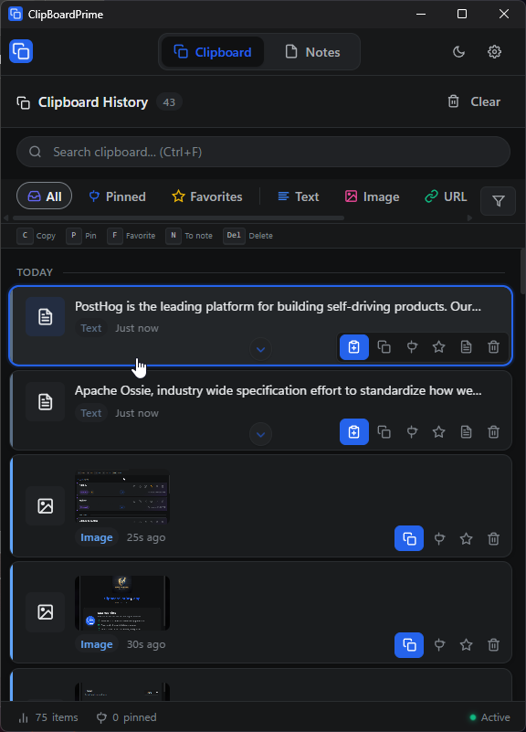
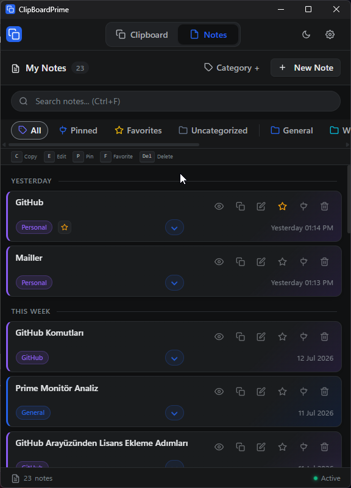
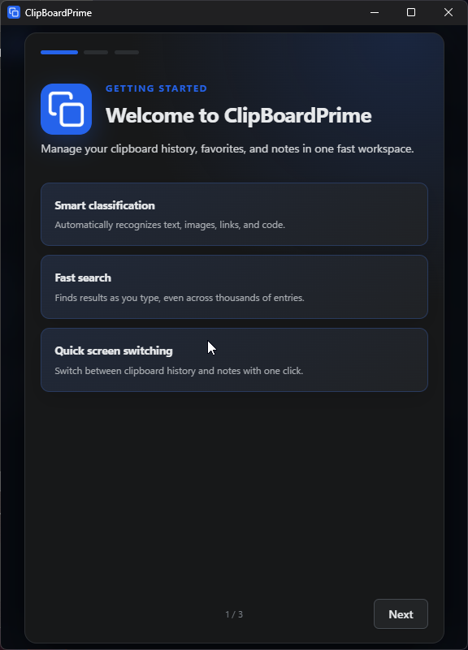
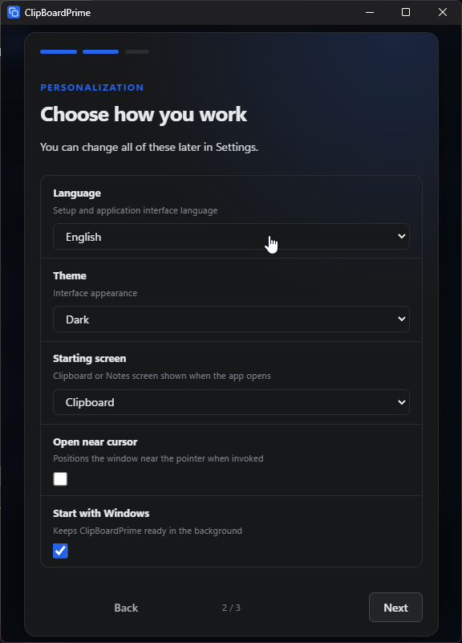
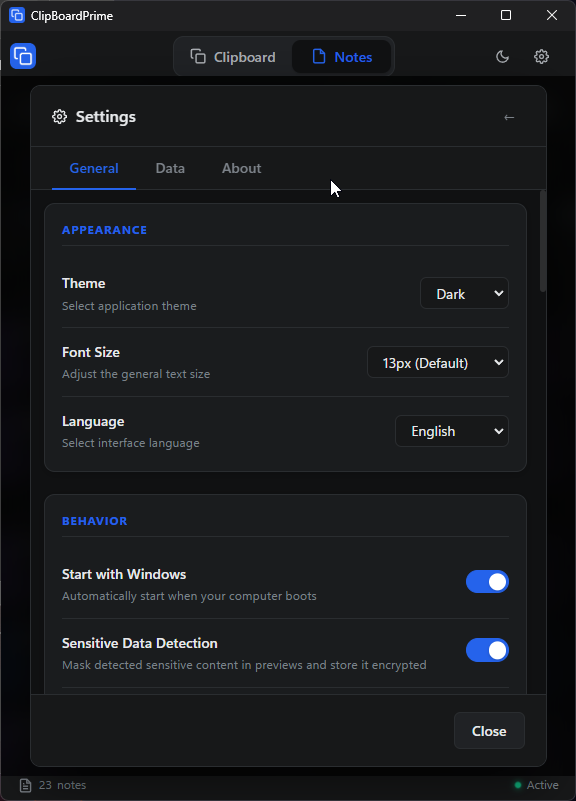

<div align="center">

  

  # ClipBoardPrime

  **A fast, private, and keyboard-friendly clipboard manager for Windows.**

  Store clipboard history locally, find past content instantly, paste it into the active window, and turn frequently used items into organized notes.

  [](package.json)
  [](https://www.electronjs.org/)
  [](#system-requirements)
  [](#quality-assurance)
  [](#security-and-privacy)
  [](LICENSE)

  [Features](#features) · [Security](#security-and-privacy) · [Installation](#installation) · [Development](#development) · [Contributing](CONTRIBUTING.md)

</div>

<p align="center">
  
</p>

## Overview

ClipBoardPrime runs quietly in the Windows system tray and records supported clipboard content in a local SQLite database. Open its compact window with the customizable global shortcut—`Ctrl + Shift + V` by default—then switch instantly between Clipboard and Notes without resizing your workspace. Search, preview, copy, edit, pin, favorite, or paste an earlier item directly into the previously active application.

The application is designed around three principles:

- **Local-first privacy:** clipboard data stays on the device unless the user explicitly exports a backup.
- **Fast interaction:** hover-to-focus cards, keyboard navigation, Space quick preview, instant search, native Windows paste automation, and system-tray access.
- **Practical organization:** clipboard history, favorites, pinned items, notes, categories, and portable backups in one application.

## Features

### Clipboard history

- Monitors text, rich HTML, URLs, email addresses, code snippets, and images.
- Detects duplicate entries and moves reused content to the top instead of creating unnecessary copies.
- Provides paginated history, live search, match highlighting, content filters, and date grouping.
- Keeps every card compact and opens full selectable content through the centered Space quick preview.
- Supports pinned and favorite items; pinned entries are preserved when regular history is cleared.
- Stores copied images as local PNG files with preview support.
- Allows text-based entries to be edited and converted into notes.

### Paste into the active window

- Paste text into the previously active Windows application using the native `SendInput` API.
- Use the primary **Paste** button, press `Enter`, or double-click a compatible clipboard item.
- Copy images back to the system clipboard with one click.
- Tracks the active target window and releases stuck modifier keys before sending `Ctrl + V`.

### Notes and categories

- Create notes manually or from clipboard items.
- Edit, delete, pin, favorite, search, and reorder notes.
- Organize notes using color-coded categories and icons.
- Preview complete clipboard entries and notes in focused, selectable detail views.
- Converts rich clipboard content to readable plain text before saving it as a note.

### Personalization and system integration

- Dark, light, and system themes.
- Turkish, English, Simplified Chinese, and Brazilian Portuguese interfaces.
- Customizable global shortcut.
- Optional launch at Windows startup.
- Adjustable clipboard polling interval and history limit.
- Installer and portable distribution modes.
- Configurable data location with integrity checks and rollback protection.
- Shared, resizable Clipboard/Notes window bounds that are remembered and recovered safely inside the active monitor.

## Security and privacy

ClipBoardPrime does not require an account, cloud service, telemetry endpoint, or remote database.

| Protection | Implementation |
|---|---|
| Renderer isolation | Electron sandbox, context isolation, and disabled Node.js integration |
| IPC boundary | Explicitly allowlisted preload API and validated main-process inputs |
| Sensitive content | Automatic detection, masking, and AES-256-GCM encryption |
| Encryption key | Protected using Electron `safeStorage`, backed by the operating-system account |
| Portable backups | Password-protected `.cpbackup` files using AES-256-GCM and scrypt key derivation |
| Database queries | Parameterized SQLite prepared statements |
| Local images | Restricted `local-file` protocol with normalized path-boundary validation |
| External links | Limited to `https:` and `mailto:` protocols |
| Import safety | Backup structure validation, duplicate detection, and category ID remapping |

Sensitive-content detection includes common payment-card formats, API tokens, JWTs, password assignments, PEM private keys, and checksum-validated Turkish identity numbers. Detection reduces accidental exposure but should not be treated as a replacement for a dedicated password manager.

> [!IMPORTANT]
> Backup passwords cannot be recovered. Store the password safely; losing it means the encrypted backup cannot be opened.

### Legacy backups

The importer remains compatible with earlier JSON exports. New exports use the encrypted `.cpbackup` format by default.

## Screenshots

<div align="center">
  <table>
    <tr>
      <td width="50%" align="center">
        <strong>Compact clipboard history</strong><br><br>
        
      </td>
      <td width="50%" align="center">
        <strong>Organized notes</strong><br><br>
        
      </td>
    </tr>
    <tr>
      <td width="50%" align="center">
        <strong>Guided first-run setup</strong><br><br>
        
      </td>
      <td width="50%" align="center">
        <strong>Live personalization</strong><br><br>
        
      </td>
    </tr>
    <tr>
      <td colspan="2" align="center">
        <strong>Clear application settings</strong><br><br>
        
      </td>
    </tr>
  </table>
</div>

## Keyboard and mouse controls

| Control | Action |
|---|---|
| `Ctrl + Shift + V` | Show or hide ClipBoardPrime; customizable in Settings |
| `Ctrl + 1` / `Ctrl + 2` | Switch directly to Clipboard / Notes |
| `Ctrl + Shift + M` | Toggle between Clipboard and Notes |
| `Ctrl + F` | Focus search in the active screen |
| `↑` / `↓` | Navigate clipboard or note cards |
| `Home` / `End` | Jump to the first or last card |
| `Enter` | Paste the selected text item into the active window |
| `Space` | Run the configured clipboard action; open note details |
| `C` / `P` / `F` / `Delete` | Copy, pin, favorite, or delete the focused card |
| `N` (Clipboard) | Save the focused clipboard item as a note |
| `E` (Notes) | Edit the focused note |
| Double-click | Paste a compatible clipboard item |
| `Escape` | Close the active modal |

## Installation

Download the installer or portable executable from the project’s [GitHub Releases](https://github.com/MaximusPrime/ClipBoardPrime/releases) page.

| Distribution | Behavior |
|---|---|
| `ClipBoardPrime Setup <version>.exe` | Standard Windows installation with an optional install directory |
| `ClipBoardPrime Portable <version>.exe` | Keeps application data in the adjacent `data` directory |

### System requirements

- Windows 10 or Windows 11, 64-bit
- A standard user account; administrator rights are not required for normal operation

## Development

### Prerequisites

- Node.js 22.12 or newer
- npm
- Windows for native paste integration and final packaging tests

### Set up the project

```bash
git clone https://github.com/MaximusPrime/ClipBoardPrime.git
cd ClipBoardPrime
npm install
npm run dev
```

`npm install` automatically aligns native dependencies with the Electron version. If a native-module mismatch occurs after changing Electron versions, run:

```bash
npm run rebuild
```

### Available commands

| Command | Purpose |
|---|---|
| `npm start` | Start the packaged-style application |
| `npm run dev` | Start in development mode with DevTools |
| `npm run check` | Validate JavaScript syntax |
| `npm test` | Run automated tests using Electron’s Node runtime |
| `npm run test:e2e` | Exercise onboarding, themes, window recovery, and workspace switching in Electron |
| `npm run build` | Build Windows installer and portable packages |
| `npm run rebuild` | Rebuild native dependencies for Electron |

## Architecture

```text
main.js                 Electron lifecycle, tray, clipboard watcher, IPC
preload.js              Allowlisted renderer-to-main bridge
database/db.js          SQLite schema, migrations, CRUD, import/export
database/db-task-worker.js  Non-blocking backup and maintenance tasks
lib/backup-crypto.js    Password-protected backup encryption
src/
  index.html            Application shell and accessible dialogs
  js/                   Clipboard, notes, settings, i18n, and UI modules
  locales/              Turkish, English, Simplified Chinese, and Brazilian Portuguese resources
  styles/               Themes and application styling
test/                   Database and backup-encryption regression tests
```

The application uses Vanilla JavaScript, HTML, and CSS in the renderer, Electron for desktop integration, `better-sqlite3` for local persistence, and `koffi` for native Windows input APIs.

## Quality assurance

Before submitting changes or producing a release:

```bash
npm run check
npm test
npm run test:e2e
npm audit
npm run build
```

The 54-test suite covers encrypted-backup round trips, password-policy enforcement, worker-based database tasks, randomized sensitive-data encryption, search and retention rules, import fidelity, safe data-location migration, IPC boundaries, localization completeness, keyboard behavior, responsive UI contracts, and compact-workspace regressions. The Electron E2E runner additionally verifies onboarding, live theme previews, modal focus protection, shared window bounds, off-screen recovery, and renderer reload behavior.

The complete dependency tree can be checked with:

```bash
npm audit
```

## Data storage

- Installed builds use Electron’s Windows `userData` directory by default.
- Development mode uses a separate `clipboard-prime-app-dev` directory under `%AppData%`.
- Portable builds store data next to the executable in `data/`.
- Users of installed builds may move the database and image directory from Settings.

The application database, encryption-key wrapper, configuration, and image cache are user data and should not be committed to the repository.

## Contributing

Bug reports, feature proposals, documentation improvements, and code contributions are welcome. Read [CONTRIBUTING.md](CONTRIBUTING.md) before opening a pull request.

When reporting an issue, include the application version, Windows version, reproduction steps, expected behavior, actual behavior, and relevant screenshots or logs. Never include real passwords, access tokens, private keys, or unredacted clipboard history.

## License

ClipBoardPrime is licensed under the [GNU General Public License v3.0](LICENSE).

## Author and support

| | |
|---|---|
| **Developer** | Maximus Prime |
| **Studio** | Maximus Prime Software |
| **Website** | [maximusprimesoftware.pages.dev](https://maximusprimesoftware.pages.dev/) |
| **Product page** | [ClipBoardPrime](https://maximusprimesoftware.pages.dev/projects/clipboardprime/) |
| **Studio email** | [maximusprimesoftware@gmail.com](mailto:maximusprimesoftware@gmail.com) |
| **GitHub** | [@MaximusPrime](https://github.com/MaximusPrime) |
| **Repository** | [MaximusPrime/ClipBoardPrime](https://github.com/MaximusPrime/ClipBoardPrime) |

---

<div align="center">
  <h3>Maximus Prime Software</h3>
  <a href="https://maximusprimesoftware.pages.dev/">
    
  </a>
  <p>
    <strong>Designed and developed by Maximus Prime Software.</strong><br>
    <sub>Private by design. Built for productive Windows workflows.</sub><br>
    <a href="https://maximusprimesoftware.pages.dev/">maximusprimesoftware.pages.dev</a> ·
    <a href="https://github.com/MaximusPrime">@MaximusPrime</a>
  </p>
</div>
